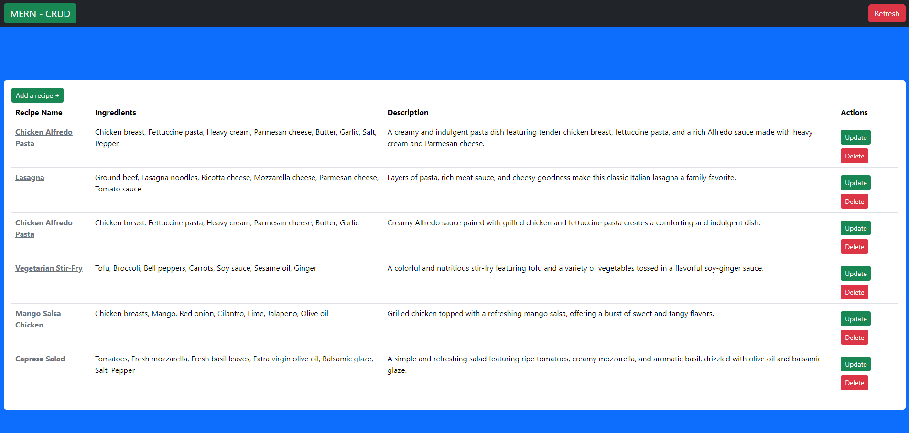
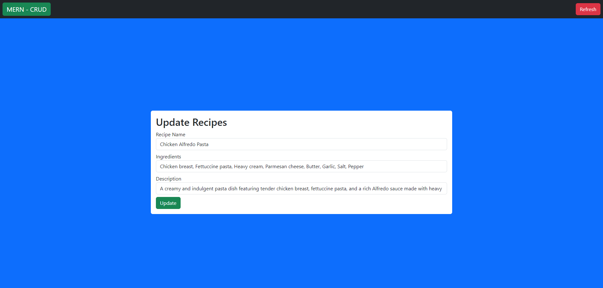
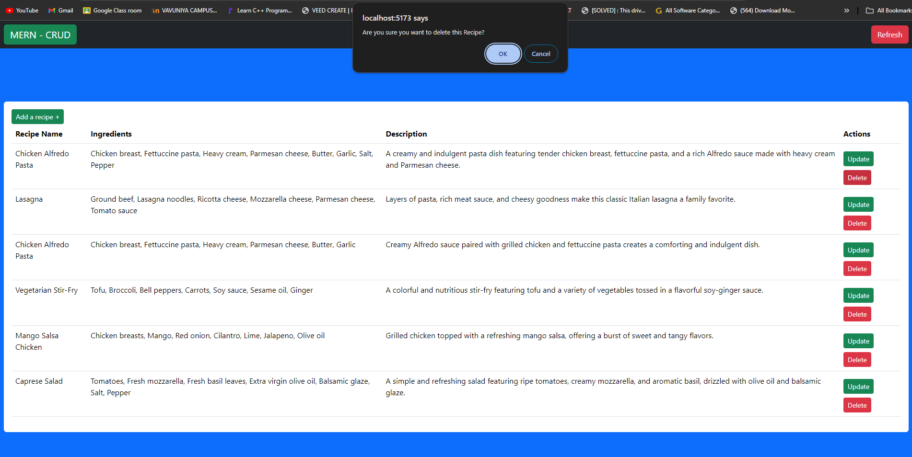
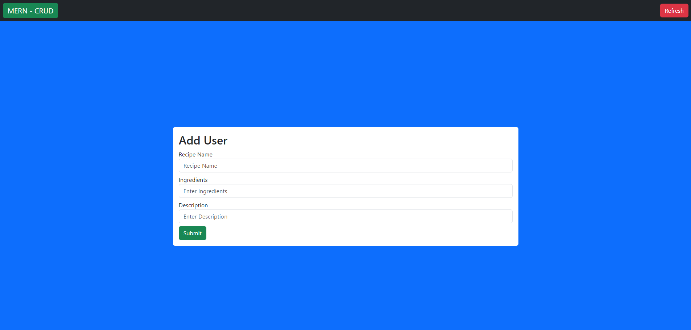

# MERN - REDUX (CRUD)- FRONTEND

This is a Full-Stack web app with CRUD operations created using Redux for state management and it allows users to Create, Read, Update, and Delete, Recipe CRUD's fields: recipeName, ingredients, and description. It is built using a modern tech stack, including React, MongoDB, Vite, Bootstrap, Express, and Node.js.

## Features

- Create
- Read
- Update
- Delete
  CRUD's fields of "recipeName", "ingredients" and "description"

## Tech Stack

- **Frontend:**
  - React
  - Vite
  - Bootstrap CSS
  
- **Backend:**
  - Express
  - Node.js
  - MongoDB

## Preview

