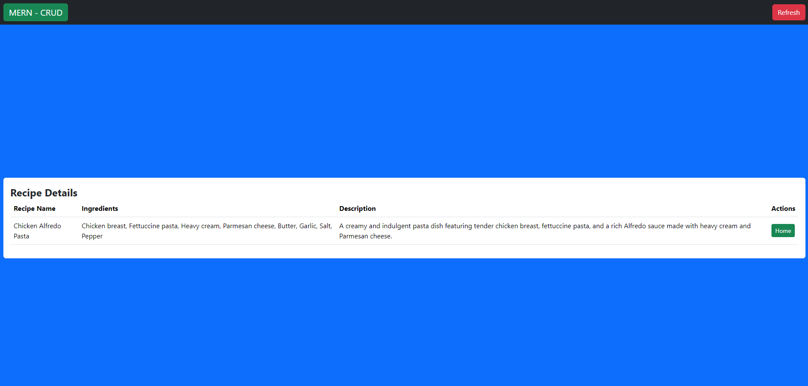

# MERN - REDUX (CRUD)- FRONTEND

This is a Full-Stack web app with CRUD operations created using Redux for state management and it allows users to Create, Read, Update, and Delete, Recipe CRUD's fields: recipeName, ingredients, and description. It is built using a modern tech stack, including React, MongoDB, Vite, Bootstrap, Express, and Node.js.

## Features

- Create
- Read
- Update
- Delete
  CRUD's fields of "recipeName", "ingredients" and "description"

## Tech Stack

- **Frontend:**
  - React
  - Vite
  - Bootstrap CSS
  
- **Backend:**
  - Express
  - Node.js
  - MongoDB
 
## To run the project,
  - clone both Frontend and Backend to the same directory.
  - then open it using IDE(VS code).
    
    ## Frontend
  - open the terminal then change the current working directory to Frontend, type "npm install" and press enter, then installation, installs all relevant packages and any packages that Frontend depends on.
  - then to start the Frontend type "npm run dev" Then it will start your development server on a specific PORT.
    
    ## Backend
  - open the terminal then change the current working directory to Backend, type "npm install" and press enter, then installation, installs all relevant packages and any packages that Backend depends on.
  - before start your development server, you must install MongoDB compass, and make the connection with the database with mongodb provided connection string to adding it to index.js files.
  - it looks like this mongoose.connect("mongodb+srv://<your-credentials>@cluster.xxxxxx.mongodb.net/crud");
  - if you haven't created Mongodb atlas you have to create your own database to accomplish the above steps, you can make that by following this link "https://www.mongodb.com/docs/atlas/getting-started/"
  - you have to add your database USERNAME & PASSWORD to this section <your-credentials> like this USERNAME:PASSWORD.
  - then start your development server by typing "nodemon index.js" Then it will start your development server on a specific PORT.

## Preview

